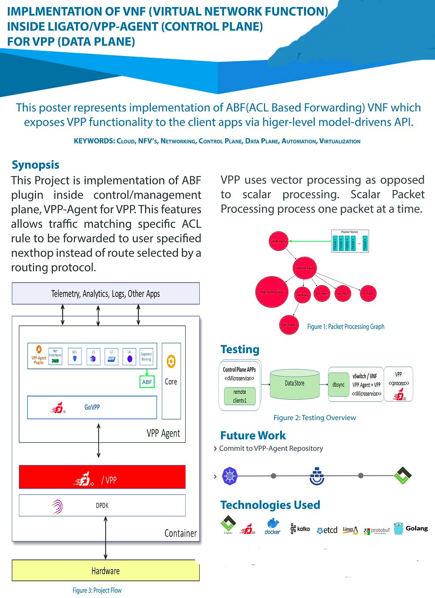

# VNF-Implementation-Work

This repository contains the code and report of work which I did in my Final Year project. The idea was to implement VNF(Virtual Network Function) logic in control plane(Ligato) for data plane (VPP). 

